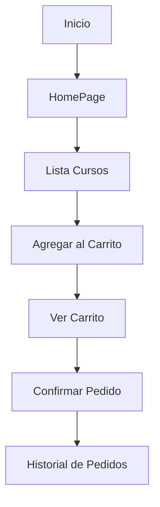
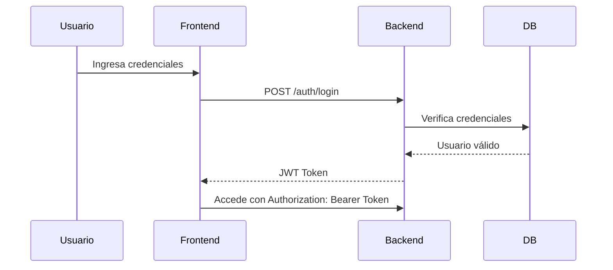
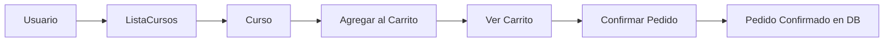
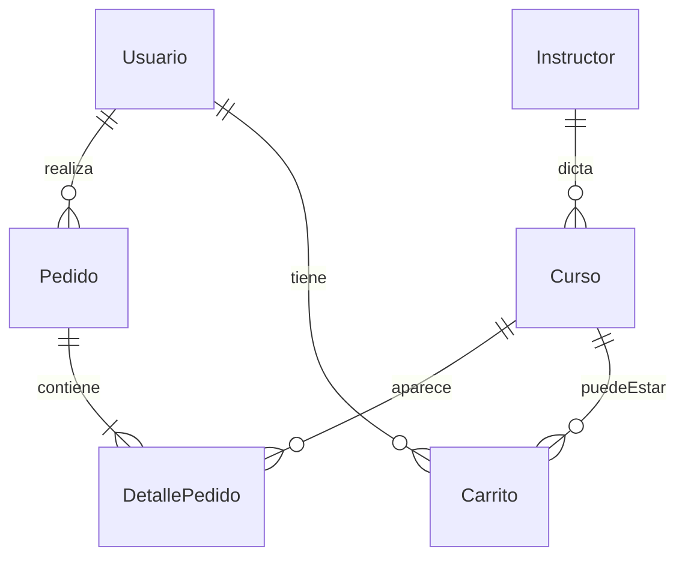

# Shiski - Plataforma de Soluciones Logísticas


## ✨ Descripción General

Shiski es una plataforma web enfocada en ofrecer soluciones logísticas mediante capacitación online. Permite a los usuarios registrarse, visualizar cursos disponibles, agregarlos al carrito y realizar pedidos. También integra funcionalidades para instructores, historial de pedidos, gestión de carritos de compra y autenticación.

---

## 📈 Stack Tecnológico

El stack tecnológico se refiere al conjunto de tecnologías utilizadas para construir la aplicación, tanto en el servidor (backend), cliente (frontend) como en la base de datos.

### ¿Qué es un stack tecnológico?

Es el conjunto de herramientas, lenguajes y frameworks utilizados para desarrollar un software. Cada elemento del stack cumple una función específica y trabaja en conjunto con los demás para ofrecer una solución completa.

### Backend (lógica y servidor)

- **Java 17**: Lenguaje de programación principal, robusto y orientado a objetos.
- **Spring Boot**: Framework para crear aplicaciones Java modernas, incluyendo REST APIs, seguridad, validaciones, etc.
- **JPA / Hibernate**: Abstracción para trabajar con bases de datos desde código Java sin necesidad de escribir SQL.
- **Maven**: Gestor de dependencias y construcción del proyecto.
- **MySQL**: Base de datos relacional donde se guardan los datos de usuarios, cursos, pedidos, etc.
- **Swagger / OpenAPI**: Permite documentar y probar los endpoints de la API.

### Frontend (interfaz gráfica)

- **React.js**: Biblioteca de JavaScript para construir interfaces de usuario interactivas.
- **Vite**: Herramienta moderna para configurar rápidamente proyectos React.
- **React Router**: Gestión de rutas y navegación entre pantallas.
- **ESLint + Babel / SWC**: Herramientas para asegurar calidad de código y compatibilidad.
- **Diseño Modular**: Separación del código por funcionalidades para facilitar el mantenimiento.

---

## 📁 Estructura del Proyecto

### Backend (carpeta: `tiendita`)

El backend está construido con Spring Boot y sigue la arquitectura típica MVC con DTOs y capas de servicio.

- `controller/` - Controladores REST que reciben las solicitudes HTTP del frontend.
- `service/` y `impl/` - Contienen la lógica de negocio de la aplicación.
- `repository/` - Interfaces que acceden a la base de datos utilizando JPA.
- `mapper/` - Transformaciones entre entidades y DTOs (Data Transfer Objects).
- `dto/` - Objetos de entrada/salida para las APIs: `Request` y `Response`.
- `exception/` - Manejadores globales de errores personalizados.
- `config/` - Configuraciones como seguridad (JWT), Swagger y CORS.
- `entity/` - Representación en Java de las tablas de la base de datos.

### Frontend (carpeta: `shiski-front-react/shiski-front`)

- `src/`
  - `assets/` - Imágenes y SVGs usados en la interfaz.
  - `modules/` - Estructura modular por función:
    - `auth/` - Módulo de login y registro.
    - `cart/` - Gestión del carrito de compras.
    - `courses/` - Visualización de cursos.
    - `home/` - Página principal con contenidos destacados.
    - `layouts/` - Componentes de estructura y navegación.

```jsx
function CourseCard({ course }) {
  return (
    <div className="course-card">
      <h3>{course.titulo}</h3>
      <p>{course.descripcion}</p>
      <span>${course.precio}</span>
    </div>
  );
}
```

### Diagrama de Flujo Simplificado



---

## 🔐 Flujo de Autenticación (JWT)



## 🔄 Flujo de Compra y Carrito



## 📊 Modelo Entidad-Relación (ER)



---

## 🛠️ Construcción de la Base de Datos

1. Diseño inicial en MySQL Workbench (ver imagen adjunta o archivo `.docx`)
2. Creación de tablas y relaciones con el script `shiski_database.sql`
3. Carga de datos de ejemplo desde `shiski_sample_data.sql`
4. Enlace con entidades JPA (`@Entity`) en Spring Boot usando `@ManyToOne`, `@OneToMany`, etc.
5. Acceso mediante `JpaRepository`, evitando SQL manual y utilizando métodos estándar (findAll, save, deleteById)

---

## 🎨 Diseño UI/UX

🔗 [Ver diseño en Figma](https://www.figma.com/design/HLiSlfc9HZ91gEPrbtk4wp/Mockup-Siski?node-id=61-122)

---

## 📌 Casos de Uso Visuales

- Un usuario visita la plataforma, navega entre cursos, añade uno al carrito y realiza el pedido.
- Un instructor accede a su perfil para ver los cursos que imparte.
- Un administrador revisa las inscripciones y pedidos confirmados.

---

## 🚀 Despliegue del Proyecto

### Requisitos

- Node.js y npm (para frontend)
- Java 17 y Maven (para backend)
- MySQL Server

### Instrucciones de ejecución local

```bash
# Clonar el repositorio
# Backend
cd backend/tiendita
mvn spring-boot:run

# Frontend
cd shiski-front-react/shiski-front
npm install
npm run dev
```

---

## ✅ Pruebas y Cobertura

- Pruebas unitarias con JUnit y Mockito
- Pruebas de endpoints con Postman/Bruno
- Cobertura de seguridad y validaciones de datos

---

## 📚 Referencia de API (Resumen)

- `POST /auth/register`
- `POST /auth/login`
- `GET /curso`
- `POST /carrito`
- `POST /pedido`
- `GET /pedido/usuario/{id}`

(Ver archivo `openapi.yaml` para detalles completos)

---

## ❓ FAQ y Errores Comunes

- **Error de CORS**: Revisar configuración en `WebConfig.java`
- **Fallo en conexión DB**: Confirmar usuario y password en `application-local.yml`
- **Falla con Token**: Asegurarse de enviar header `Authorization: Bearer <token>`
- **Frontend sin estilo**: Revisar rutas relativas y estado del servidor Vite

---

## 👥 Autores

- **Tamara Escobar** – Desarrollo completo del backend (APIs, base de datos en MySQL y conexión con IntelliJ), documentación general, 85% preparación del primer pitch, 25% exposición del pitch y 10% del diseño UI/UX en Figma.
- **Carolina Muñoz** – 15% del primer pitch, 25% de la exposición, 90% del diseño UI/UX en Figma, 70% del desarrollo del frontend (React).
- **Camila Cáceres** – 25% de la exposición del pitch, 30% del desarrollo del frontend (React).
- **Fabián Vargas**  – 25% exposición del pitch y apoyo general con tareas mínimas.
- **Franco Ramirez** – apoyo general con tareas mínimas.

---

## 📝 Licencia

Este proyecto ha sido desarrollado con fines **educativos**. Todos los derechos pertenecen a sus respectivos autores y al bootcamp de formación. No se autoriza su uso con fines comerciales sin autorización expresa.

